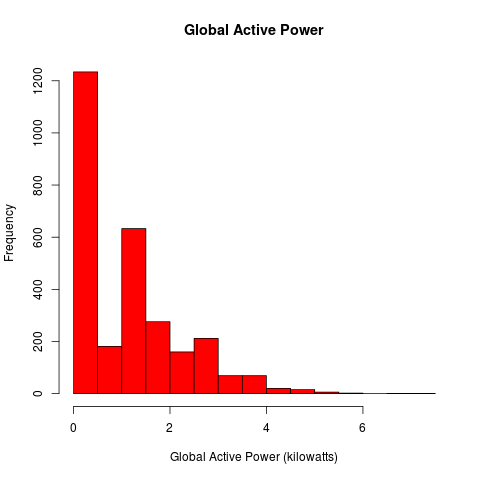
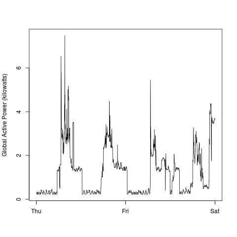
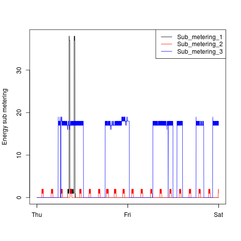
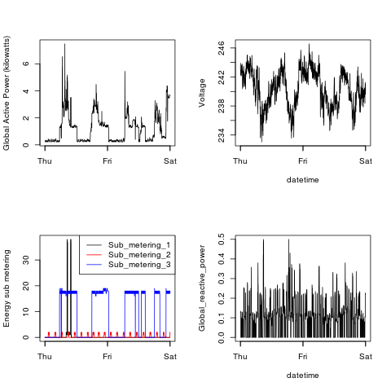

## Instructions

*Forked from [Roger Peng's repository](https://github.com/rdpeng/ExData_Plotting1), as per instructions*

1. (Optional) Source `preprocess.R`. *(This file downloads the raw data if it does not exist in the directory, and processes it leaving only the required data)*
2. Source `plot1.R`, `plot2.R`, `plot3.R` and `plot4.R`. The output would be in the same directory as the files.

### Plot 1

 

### Plot 2

 

### Plot 3

 

### Plot 4

